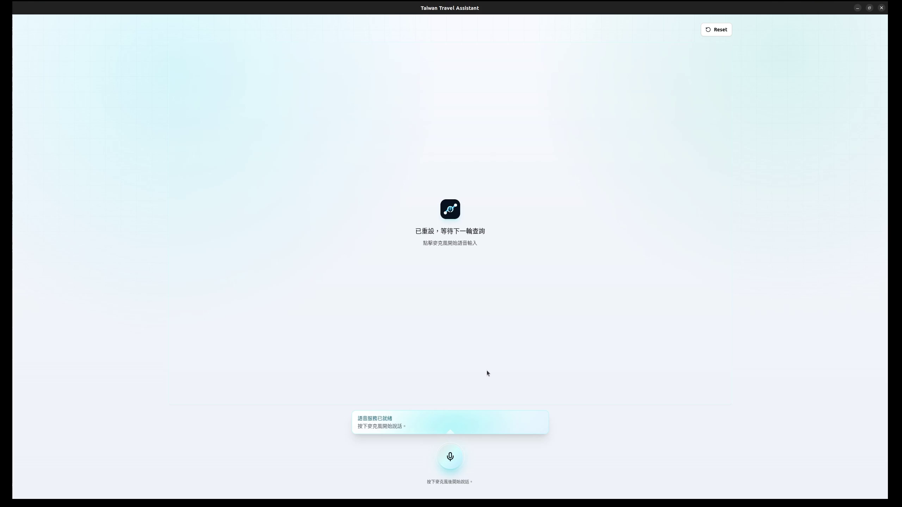
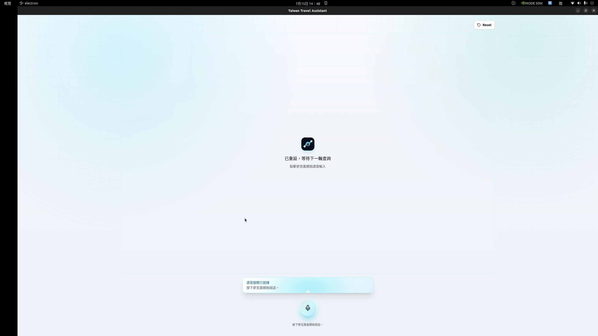
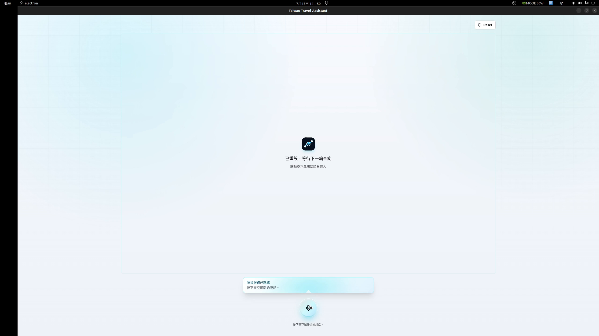

# Taiwan-Travel-Assistant (TTA)

  

<h1 align="center">Taiwan Travel Assistant</h1>

  
  
  =10">
  
  
  

**Taiwan-Travel-Assistant** 是為台灣旅遊情境設計的桌面語音助理。使用者可直接用語音查詢景點、路線、附近小吃與飯店空房；應用會以地圖、QR Code 與天氣資訊呈現結果。

這Repo只是demo，有關於程式碼或合作使用，請洽國立雲林科技大學 GenAI Lab，或是建立 Issue。

Demo之圖標為開發中錄製，現在已assert裡為主。
## 主要功能

- 台灣景點資訊、營業資訊與天氣
- 路線終點與景點附近小吃，以及可用手機掃描的 Google Maps QR Code
- 台灣飯店空房、房型、價格、付款與取消資訊
- 中文語音對話、即時音量光球、可中斷播放與自然的多輪追問
- 本機 LLM、ASR、TTS 與 intent routing，減少敏感語音資料離開裝置

## Demo
### 查詢景點

  

  點擊圖片觀看完整影片(檔案過大只能下載觀看)

### 導航

  

  點擊圖片觀看完整影片

### 找飯店

  

  點擊圖片觀看完整影片

## 執行環境
建議環境：

- NVIDIA Jetson AGX Orin，Ubuntu 22.04 / JetPack 相容環境
- Node.js `^20.19.0` 或 `>=22.12.0`
- npm `>=10`
- Python `3.10.12`
- 可用的 `CUDA 126`
- llama.cpp GGUF、Breeze ASR 與 BlueMagpie TTS 模型

## 系統架構

TTA Pipeline

## 限制

目前開發的 session memory 只存在執行期間，不提供持久化；Hotelbeds、Google Maps、天氣服務與本地語音模型的可用性仍受外部服務、硬體與模型設定影響。

## 授權

Copyright © TTA Development team. All Rights Reserved. 詳情請看 **[LICENSE](.github\LICENSE)**

## 致謝
https://github.com/OpenFormosa 感謝開發團隊釋出台灣用的TTS

